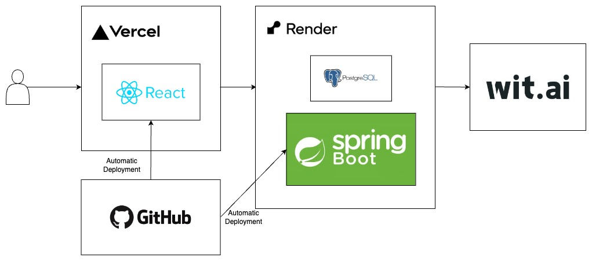
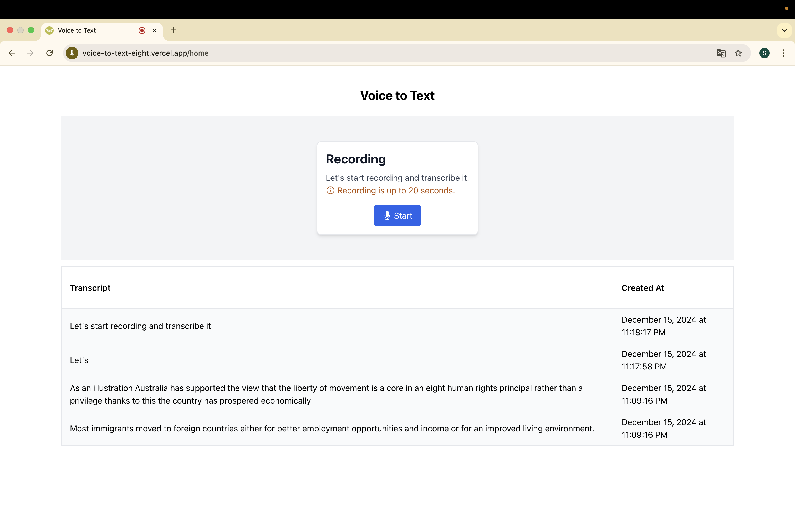
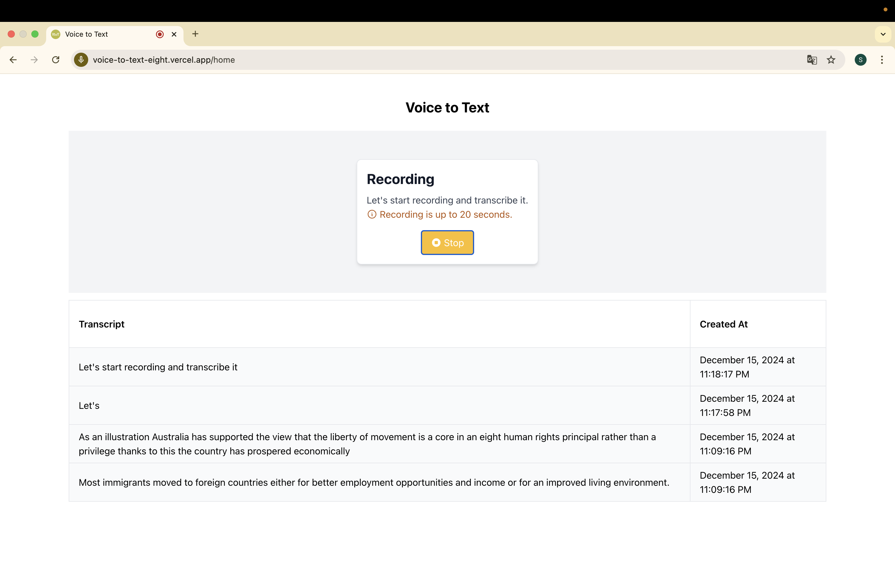
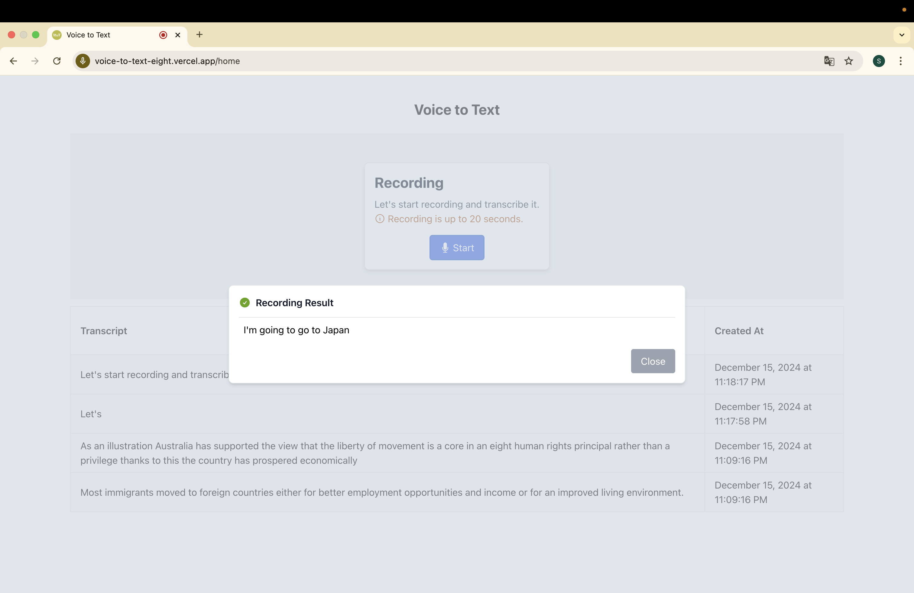
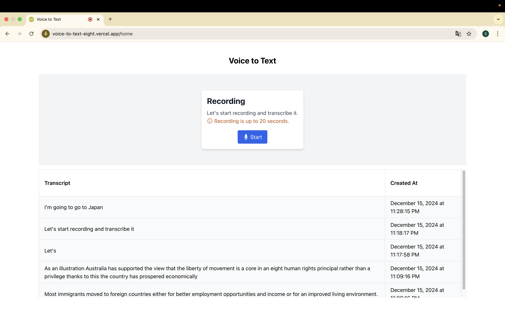

# Voice to Text Client

The **Voice to Text Client** is a front-end application designed to record voice and transcribe it. It works in conjunction with the [Voice to Text API](https://github.com/goothrough/voice-to-text-api), providing a transcropt generated by Wit.ai.

## Features

- User-friendly interface for recording voice
- Seamless integration with the [Voice to Text API](https://github.com/goothrough/voice-to-text-api)
- Easily get the transcript of voice record, integrating with Wit.ai

## Architecture Diagram

The following diagram illustrates the architecture of the Voice to Text application:

## Technologies Used

The development and deployment of the Which Room Client involve the following skills and technologies:

- **Language**: TypeScript
- **Framework**: React
- **Styling**: Tailwind CSS
- **Cloud Services**: Vercel
- **Version Control**: GitHub
- **API Integration**: RESTful APIs([Voice to Text API](https://github.com/goothrough/voice-to-text-api))
- **Deployment**: Automatic deployment to Vercel

## How It Works

You can check out the deployed application using the link below:  
https://voice-to-text-eight.vercel.app

And the following image demonstrates how the application looks and functions:

- Before starting recording

    

- When recording in progress

    

- Display transcript generated by Wit.ai

    

- Update the transcript history table

    
